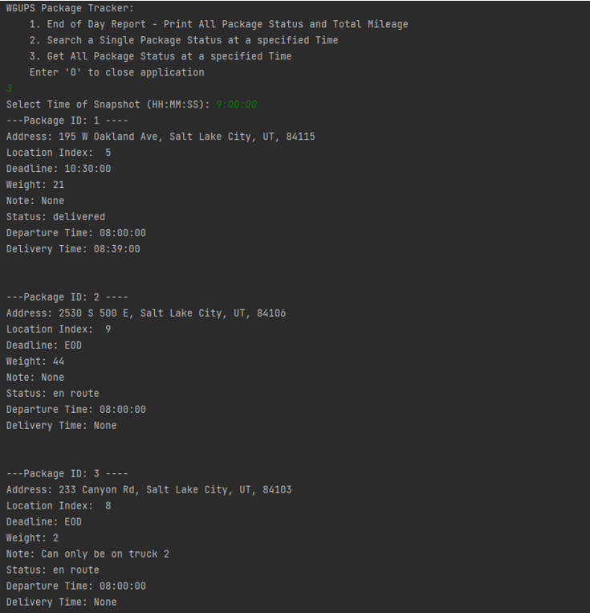

  

  
  
  
  
  

Python Logistics Pathfinding Application

- Pathfinder uses a Greedy Algorithm because the routes in question are part of a closed circuit where pathing is never restricted. K-Nearest Neighbors (KNN) would be more optimal but is overkill for the scope of this particular solution.
- The csv data is stored in a Hashmamp data structure due to it's O(1) access time.
- Output creates standard reports as deliveries are executed by trucks:

